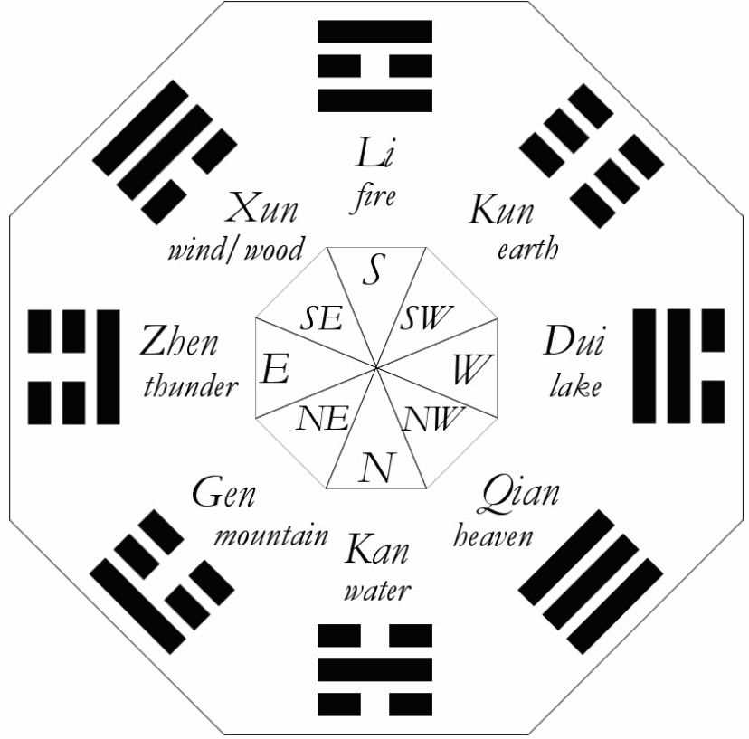

# era.style (v2)

start with a point of interest - and radiate out in sectors - discounts to businesses based on the day compared to a daily clock in accordance to i-ching (as a first example)



## output

an example for in 2-3 days

```
Businesses in sector 7 ☰ : [
  'Business_03c9z',
  'Business_syx31',
  'Business_883vrn',
  'Business_o4dmic',
  'Business_cu5eue'
]
```
